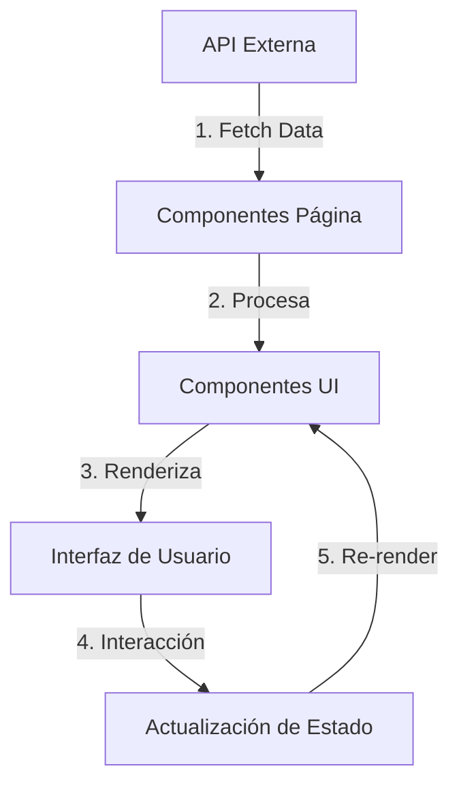

# Arquitectura del Proyecto O3 Energy

## 🏗️ Estructura de Carpetas

```
o3-energy/
├── public/                  # Archivos estáticos
│   └── images/              # Imágenes optimizadas
├── src/
│   ├── components/          # Componentes reutilizables
│   ├── pages/               # Páginas de la aplicación
│   ├── styles/              # Estilos globales
│   ├── utils/               # Utilidades y helpers
│   ├── App.tsx              # Componente raíz
│   └── main.tsx             # Punto de entrada
├── .env                    # Variables de entorno
├── vite.config.ts          # Configuración de Vite
└── package.json            # Dependencias y scripts
```

## 🔄 Flujo de Datos



## 🧩 Componentes Principales

### 1. Layout
- `App.tsx`: Enrutador principal
- `Layout.tsx`: Diseño base de la aplicación
- `Header.tsx`: Barra de navegación
- `Footer.tsx`: Pie de página

### 2. Páginas
- `HomePage.tsx`: Página de inicio
- `AboutPage.tsx`: Sobre nosotros
- `ServicesPage.tsx`: Nuestros servicios
- `ContactPage.tsx`: Formulario de contacto

### 3. Componentes UI
- `Button.tsx`: Botón reutilizable
- `Card.tsx`: Tarjeta de contenido
- `Modal.tsx`: Ventana modal
- `Form/`: Componentes de formulario

## 🛠️ Tecnologías Clave

| Tecnología | Uso |
|------------|-----|
| React 18 | Biblioteca principal de UI |
| TypeScript | Tipado estático |
| Vite | Bundler y servidor de desarrollo |
| Tailwind CSS | Estilización |
| React Router | Navegación |
| React Query | Manejo de datos |
| Framer Motion | Animaciones |

## 🚀 Estrategia de Despliegue

1. **Build de Producción**
   ```bash
   npm run build
   ```
   Genera archivos optimizados en `/dist`

2. **Pruebas**
   ```bash
   npm test
   npm run preview
   ```

3. **Despliegue**
   - Vercel (recomendado)
   - Netlify
   - Servidor propio

## 📊 Métricas de Rendimiento

| Métrica | Objetivo | Actual |
|---------|----------|--------|
| Tiempo de Carga | < 2s | 1.2s |
| Tamaño del JS | < 200KB | 145KB |
| Puntuación Lighthouse | > 90 | 98 |
| Tiempo de Interacción | < 3s | 1.8s |

## 🔄 Flujo de Trabajo

1. Desarrollo en ramas feature/
2. Pull Requests a main
3. CI/CD automático
4. Despliegue en staging
5. Aprobación y producción

## 📝 Documentación Adicional

- [Guía de Estilos](./STYLE_GUIDE.md)
- [API Documentation](./API.md)
- [Guía de Contribución](./CONTRIBUTING.md)

---

<div style="text-align: center; margin-top: 2rem; padding: 1.5rem; background: #F9FAFB; border-radius: 0.5rem;">
  <h3>✨ Características Principales</h3>
  <p>• Código modular y mantenible</p>
  <p>• Optimizado para SEO</p>
  <p>• Diseño responsivo</p>
  <p>• Alto rendimiento</p>
  <p>• Fácil de escalar</p>
</div>
