# Visualización de Componentes

## Diagrama de Componentes

```mermaid
graph TD
  About[About]
  AboutSummary[AboutSummary]
  BackToTopButton[BackToTopButton]
  Contact[Contact]
  CTA[CTA]
  EnergyEfficiencyPage[EnergyEfficiencyPage]
  EnergySolutionsPage[EnergySolutionsPage]
  EPCSolarPage[EPCSolarPage]
  FeaturedProjects[FeaturedProjects]
  Footer[Footer]
  Header[Header]
  Hero[Hero]
  Locations[Locations]
  NewsSummary[NewsSummary]
  OptimizedImage[OptimizedImage]
  Projects[Projects]
  ProjectsPage[ProjectsPage]
  Services[Services]
  ServicesSummary[ServicesSummary]
  SolarFinancingPage[SolarFinancingPage]
  SolarInstallationPage[SolarInstallationPage]
  SolarMaintenancePage[SolarMaintenancePage]
  SolarProjectDevelopmentPage[SolarProjectDevelopmentPage]
  Stats[Stats]
  Team[Team]
  Hero --> OptimizedImage
```

## Lista de Componentes

| Componente | Archivo | Dependencias |
|------------|---------|--------------|
| About | `./src/components/About.tsx` | react |
| AboutSummary | `./src/components/AboutSummary.tsx` | react |
| BackToTopButton | `./src/components/BackToTopButton.tsx` | react |
| Contact | `./src/components/Contact.tsx` | react, formik, yup, react-icons/fa |
| CTA | `./src/components/CTA.tsx` | react |
| EnergyEfficiencyPage | `./src/components/EnergyEfficiencyPage.tsx` | react, react-router-dom, react-icons/fa |
| EnergySolutionsPage | `./src/components/EnergySolutionsPage.tsx` | react, react-router-dom, react-icons/fa |
| EPCSolarPage | `./src/components/EPCSolarPage.tsx` | react, react-router-dom, react-icons/fa |
| FeaturedProjects | `./src/components/FeaturedProjects.tsx` | react |
| Footer | `./src/components/Footer.tsx` | react, constants |
| Header | `./src/components/Header.tsx` | react, react-router-dom, constants |
| Hero | `./src/components/Hero.tsx` | react, ./OptimizedImage |
| Locations | `./src/components/Locations.tsx` | react, react-icons/fa |
| NewsSummary | `./src/components/NewsSummary.tsx` | react |
| OptimizedImage | `./src/components/OptimizedImage.tsx` | react, clsx |
| Projects | `./src/components/Projects.tsx` | react, react-router-dom, constants |
| ProjectsPage | `./src/components/ProjectsPage.tsx` | react, react-router-dom, data/projects, react-icons/fa |
| Services | `./src/components/Services.tsx` | react, constants |
| ServicesSummary | `./src/components/ServicesSummary.tsx` | react |
| SolarFinancingPage | `./src/components/SolarFinancingPage.tsx` | react, react-router-dom, react-icons/fa |
| SolarInstallationPage | `./src/components/SolarInstallationPage.tsx` | react, react-router-dom, react-icons/fa |
| SolarMaintenancePage | `./src/components/SolarMaintenancePage.tsx` | react, react-router-dom, react-icons/fa |
| SolarProjectDevelopmentPage | `./src/components/SolarProjectDevelopmentPage.tsx` | react, react-router-dom, react-icons/fa |
| Stats | `./src/components/Stats.tsx` | react |
| Team | `./src/components/Team.tsx` | react, constants |
